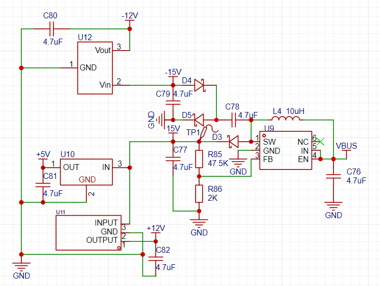
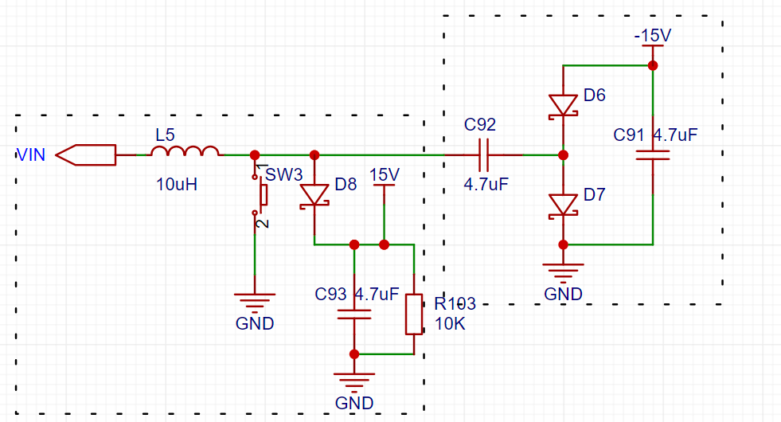
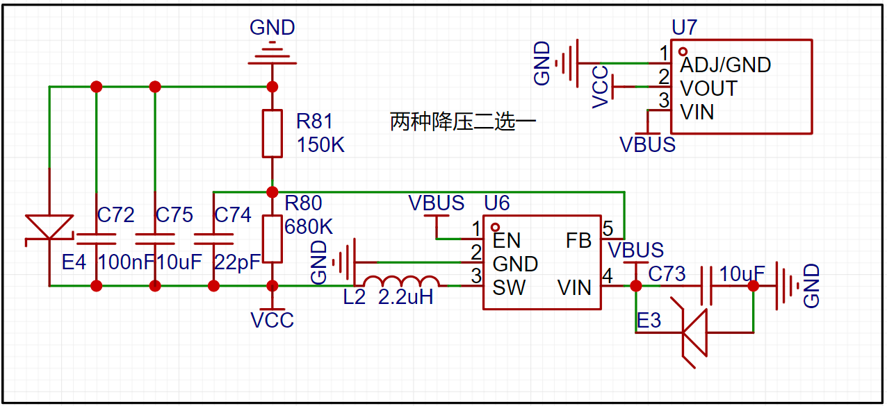
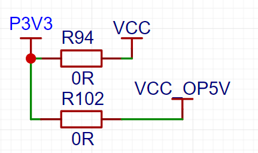
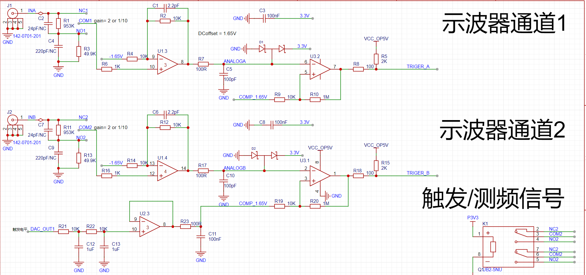
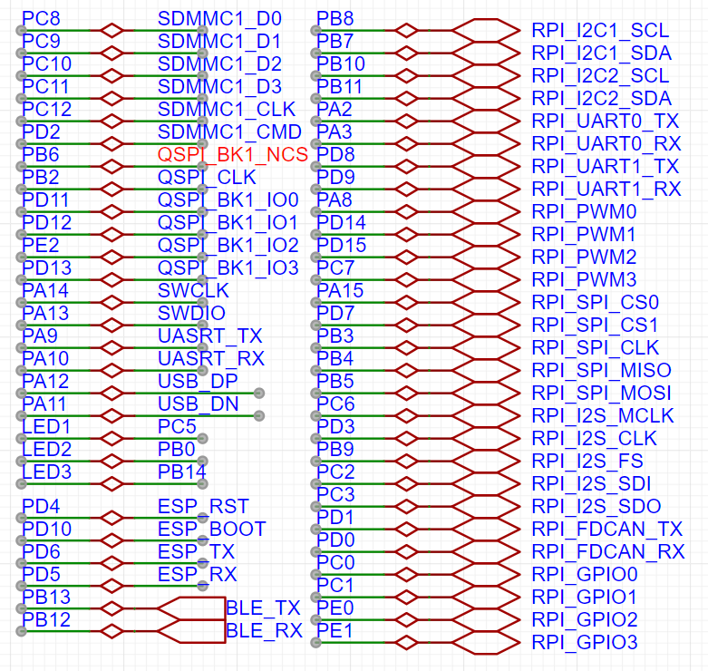
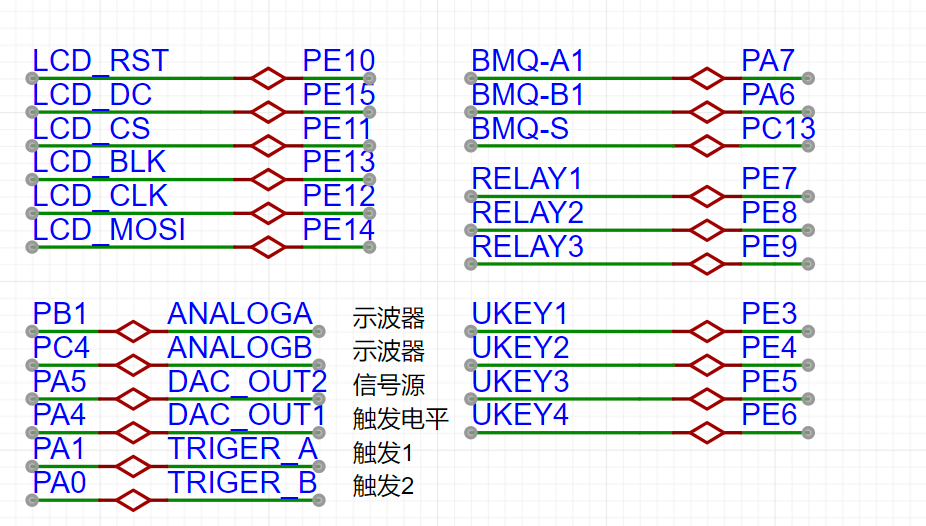
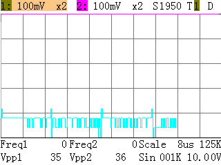

# 基于STM32H750的简易示波器和信号发生器
## 前言
本人之前一直想做一个简易示波器，完整的学习下示波器的软硬件制作流程，上个月有幸看到立创举办了这个训练营，一时激动，参加了。
虽然后面因为工作繁忙，没能自己重头写一下软件设计，但在硬件设计上已是收获满满。在此立个FLAG，一定要自己完成一遍示波器的软件设计。
## 硬件电路
因为是简易示波器，所有此次训练营的案例只是一个小范围信号输入检测。在硬件电路上极大地简化了。但我相信能够对此次的硬件电路深入理解，举一反三，定能丰富我们的电路知识。
## 电源部分

运放部分的正负电源由这部分提供。
其中MT3608的BOOST电路我们都清楚，但是加上两个二极管和两个电容后竟然产生了一个负压，这就显得比较高级了。目前这样太乱，因此将电路简化一下。得到下面的电路

左边的框是BOOST部分的简化，这里不做分析。让我们来看右边框的电路。因为左边部分的开关高速的开关，让C92左侧的电源变成了一个脉冲信号。当信号从低往高时，C92电容充电，左+右-，当信号从高往低时，C92左侧变为0伏，但电容两侧压差不能突变，导致他右侧的电压变为-V,这样就让电流经GND->C91->D6->C92->GND。最终效果就是D6正端电压为一个比-V稍微高一点的负电压。
后面我到网上查找相应资料时，发现右侧框图的结构就是典型的电荷泵电路，能量的传递靠的都是电容的压差。因为一般能够提供的电流都比较小，大概几十毫安。一般都是作为简易的运放供电使用。

这是我系统的3.3V电源，将开关电源和LDO都整上了。实际焊接时我只焊了开关电源。

信号继电器供电我初版是只做了跳线到3.3V，但我买的信号继电器是5V供电规格的，大意了。所以这里加上了两路电源选择。

示波器模拟前端部分官方案例说的很清楚了，就是衰减、增益、直流偏置和比较器触发。
目前STM32H750VBT6的芯片只要20左右,所以我选择不外借开发板，直接将芯片集成上去。同时，考虑到DSO、DDS、LCD、按键、继电器这些加起来也没用多少引脚。剩下的引脚要是不利用起来就浪费了。同时增加他的可玩性。

所以在板子上增加了一些外设，例如TF卡，可以扩展波形截图的功能；QSPI，外扩FLASH；KT6368A蓝牙和ESP8266WIFI，增加远程控制和显示。还剩下的引脚我选择了适配模块最多的树莓派扩展接口，能够方便的直插各种模块。
## 软件
为了方便布局布线，我将一些接口的引脚修改了，以下是修改后的接口引脚。

普通IO只要修改引脚就行，需要注意的是修改SPI时，SPI传输中断极其DMA传输中断的优先级不能过高，不然会出现卡死的情况。
关于SD保存波形，我是打算将波形保存为BMP图片,如下是在开始时所截的图。

但是我在运行时进行截图，发现会卡死，目前猜测是TF卡写入和读取使用的阻塞方式，频繁被ADC中断打断，后续会换成DMA方式再做尝试。目前该功能还没完成。

右下方的飞线是前面说的继电器电源问题（已经在PCB中修改），左上角的飞线是因为我所选购的3225封装的晶振不能让蓝牙芯片工作，于是飞了附带的2脚晶振作为测试。后面有通过蓝牙的透传串口将ADC DMA缓冲数据上传到VOFA+显示的视频。
ESP8266还未焊接，因为对于网络相关的操作和知识我还在学习中，待我学会后将这块补全，做出好玩的功能。
目前大概就是这样，忙中偷闲参加这次训练营的进度。
代码在github，感兴趣可以关注下，后续的新功能做出来了的话会更新（如果有空的话）。[https://github.com/starry-m/H750_ADCDAC.git](https://github.com/starry-m/H750_ADCDAC.git)

## 后续计划与想法
|功能|完成情况|
|-|-|
|屏幕截图|待完成|
|上位机显示和控制（蓝牙）|待完成|
|USB模拟U盘升级固件|待完成|
|WIFI控制|待完成|

虽然离自己完整制作一个示波器的目标还有很远，但这次训练营实践让我走了一遍硬件电路的设计和绘制，也不错了。

## 问题记录
下载器下载后可以运行，但是复位上电后屏幕不能显示
解决；应该是启动时电源不稳定，延时1s启动，则正常显示。